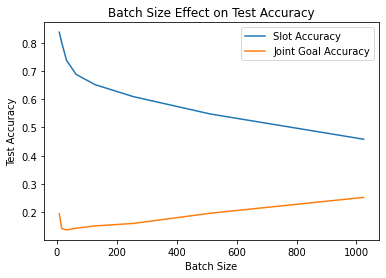

## DST Experiment Updates

### Experiment Configuration

The conducted experiments are configured as below:

- `MultiWOZ 2.1` is used, divided into train, dev/validation and test data (in JSON format). The data is generated using scripts from the following repo https://github.com/jasonwu0731/trade-dst.
- `MemNN`, one of ParlAI agents, is used as the model
- The number of epochs is 100
- `batch` is used as candidates source, meaning that when generating possible labels (and computing their probabilities), we only take into accounts the labels that exist within a certain training batch. Ideally, we don't do this, we want to consider all possible labels, i.e. using `fixed` option in ParlAI. But, it wasn't possible to do in my local machine because the computation is heavy. We need to list all possible slot values and define them for our `Teacher`. Certainly, using this `fixed` option, we will get a more accurate model. I need a server that I can use to conduct the experiment using the `fixed` option. Please refer here for documentation on candidates source: https://parl.ai/docs/tutorial_torch_ranker_agent.html.
- `batch_size` is varied. I am using `32`, `64`, `128` and `256`. So, there are 4 models trained, hence there are 4 results as well.

The script used is as below:

```
parlai train_model -t multiwoz_dst -mf $SAVED_MODEL_PATH$ -bs $BATCH_SIZE$ -eps 100 -m memnn -cands batch -ecands batch -mcs "accuracy,joint_goal_acc" --no-cuda
```

The `accuracy` metric is the default metric, which basically corresponds to `slot accuracy` in `TRADE` paper, i.e. one point is obtained for every correct belief state in each dialog turn. Meanwhile, the new, custom, metrics `joint_goal_acc` corresponds to `joint goal accuracy` in `TRADE` paper, i.e. one point is obtained only if ALL BELIEF STATES in a dialog are correct.

### Experiment Result

The results on the `validation` set are as below:

1. For `batch_size=32`, `0.7457 slot accuracy` and `0.1430 joint goal accuracy` are obtained.
2. For `batch_size=64`, `0.6996 slot accuracy` and `0.1340 joint goal accuracy` are obtained.
3. For `batch_size=128`, `0.6570 slot accuracy` and `0.1480 joint goal accuracy` are obtained.
4. For `batch_size=256`, `0.6191 slot accuracy` and `0.1710 joint goal accuracy` are obtained.

The results on the `test` set are as below:

1. For `batch_size=32`, `0.7379 slot accuracy` and `0.1371 joint goal accuracy` are obtained.
2. For `batch_size=64`, `0.6878 slot accuracy` and `0.1431 joint goal accuracy` are obtained.
3. For `batch_size=128`, `0.6512 slot accuracy` and `0.1512 joint goal accuracy` are obtained.
4. For `batch_size=256`, `0.6088 slot accuracy` and `0.1602 joint goal accuracy` are obtained.

If plotted, the accuracies on the `test` set is as below:

<p align="center">
 
</p>

Some insights from the above result:

1. The result on the `validation` and `test` set are similar
2. The obtained `slot accuracy` is decent although not very good. The `joint goal accuracy` is very bad `<15%`. Need a significant improvement on `joint goal accuracy`. One way to start is by defining the ontology, using the `fixed` option and use better language model.
3. `batch_size` doesn't seem to be crucial hyperparameter looking at the above value. But, there is an inclination that the `slot accuracy` decreases and the `joint goal accuracy` increases as the `batch_size` increases. I'll investigate this more when I have more results, i.e. more `batch_size`s tried.

### Error Analysis

TBD
